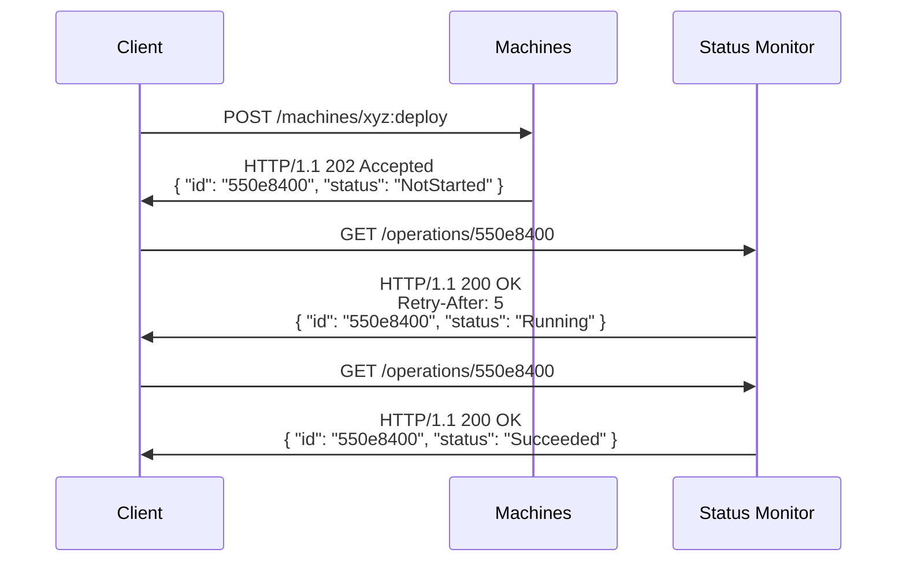

# Canonical REST API Guidelines


## History

<details>
  <summary>Expand history</summary>

| Date        | Notes                                                          |
| ----------- | -------------------------------------------------------------- |
| 2024-Jan-16 | 1st draft of the Canonical REST API Guidelines                 |

</details>

## Index

- [Introduction - How to read this document](#introduction---how-to-read-this-document)
- [General Service/Product guidelines](#general-serviceproduct-guidelines)
- [API design guidelines](#api-design-guidelines)
  - [HTTP and REST](#http-and-rest)
    - [Standard HTTP Methods and CRUD](#standard-http-methods-and-crud)
      - [Create Resources](#create-resources)
    - [Custom HTTP Methods and Actions](#custom-http-methods-and-actions)
    - [HTTP Return codes](#http-return-codes)
    - [HTTP Query parameters](#http-query-parameters)
    - [HTTP Headers](#http-headers)
  - [JSON](#json)
  - [Naming convention](#naming-convention)
  - [Errors](#errors)
  - [Collections](#collections)
    - [Query the collections](#query-the-collections)
      - [Filters](#filters)
      - [Sorting](#sorting)
      - [Pagination](#pagination)
      - [Embedding](#embedding)
  - [Long running operations](#long-running-operations)
  - [Conditional requests](#conditional-requests)
    - [Expected behaviour](#conditional-request-expected-behaviour)
    - [Computing ETags](#computing-etags)

## Introduction - How to read this document.

The requirement level keywords **MUST**, **MUST NOT**, **REQUIRED**, **SHOULD**, **SHOULD NOT**, **RECOMMENDED**, **MAY**, and **OPTIONAL** used in these guidelines are to be interpreted as described in [RFC 2119](https://www.ietf.org/rfc/rfc2119.txt)

In order to make these guidelines more readable, we are going to use the following patterns

✅ **YOU MUST** adopt this pattern. If there is the need of an exception, you **MUST** contact the CTO office **prior** to implementation.

☑️ **YOU SHOULD** adopt this pattern. If not following this advice, you **MUST** disclose your reason during the spec review of your API.

✔️ **YOU MAY** consider this pattern if appropriate to your situation. No specific notifications are needed.

⚠️ **YOU SHOULD NOT** adopt this pattern. If not following this advice, you **MUST** disclose your reason during the spec review of your API.

⛔ **YOU MUST NOT** adopt this pattern. If there is the need of an exception, you **MUST** contact the CTO office prior to implementation.

## General Service/Product guidelines

When you design and implement your API

✅ **YOU MUST** have a complete understanding of this document.

✅ **YOU MUST** implement API versioning starting with the very first release of the product.

✅ **YOU MUST** implement API with client-obsession in mind. It must be simple to understand and simple to use.

✅ **YOU MUST** introduce changes in the API in a way that is backwards compatible.

✅ **YOU MUST** follow [The Robustness Principle](https://en.wikipedia.org/wiki/Robustness_principle): be liberal in what you accept, be conservative in what you send. 

✅ **YOU MUST** generate an [OpenAPI Definition](https://github.com/OAI/OpenAPI-Specification/blob/main/versions/2.0.md) describing the service. The OpenAPI spec will allow you to auto-generate and maintain SDKs with very low effort.


## API Design Guidelines

### HTTP and REST

The guidelines in this document encompass numerous concepts derived from the HTTP specification [HTTP specification (RFC7231)](https://datatracker.ietf.org/doc/html/rfc7231), and we recommend reviewing it if you are not already familiar.

In a nutshell, REST is a widely adopted architectural style for web services, specifically tailored to work well with HTTP/1.1 and the resource-oriented software architecture. When developing your REST API, you SHOULD conceptualize it as a resource hierarchy, wherein each node represents either a _resource_ or a _collection_ of resources.

- A collection contains a list of resources of the same type. For instance, a _machine_ has a collection of _disks_.

- A resource has a certain state and may have zero or more sub-resources. Each sub-resource, in turn, can be categorized as either a straightforward resource or a collection resource.


<details>
  <summary>Example</summary>

MAAS machines could be represented with 
- A collection of machines `/machines`. Each machine has the following resources
  - `/machines/{machine_id}`: the machine itself
  - `/machines/{machine_id}/disks`: the collection of machine disks
  - `/machines/{machine_id}/disks/{disk_id}`: a machine disk
  - `/machines/{machine_id}/interfaces`: the collection of machine interfaces
  - `/machines/{machine_id}/interfaces/{interface_id}`: a machine interface
  - ..so forth and so on..

</details>

#### Standard HTTP methods and CRUD
There is a natural conceptual mapping between HTTP methods (*POST*, *GET*, *PUT*, *PATCH*, and *DELETE*) and CRUD operations on entities in REST. For example, the CRUD operations on the `/machines/{machine_id}` would map to 

Method | Description | 
-------|-------------| 
GET    | Read the machine details |
POST   | Create a new machine entity | 
PUT    | Create/Replace the entire machine | 
PATCH  | Create/Modify the entity |
DELETE | Remove the entity | 

##### Create resources
When you design your API, you decide the contract between the product and the clients. Part of this contract are the endpoint paths, the request structures and the responses.
Fault tolerance is part of this contract as well and can be critical in some scenarios. 
If you guarantee Idempotency for all the HTTP methods, you would allow the client to write fault-tolerant application very easily. 

✅ **YOU MUST** return the URL of the created resource with a `201-Created` response code.

✔️ **YOU MAY** make the HTTP POST method idempotent. You can leverage on the `Repeatability-Request-ID` and `Repeatability-First-Sent` headers.


<details>
  <summary>Example</summary>

See [here](https://docs.oasis-open.org/odata/repeatable-requests/v1.0/cs01/repeatable-requests-v1.0-cs01.html#sec_Introduction)

</details>

<details>
  <summary>If you make POST idempotent, you MUST adopt the guidelines in this menu (expand it).</summary>

Fault tolerant applications require that clients retry requests for which they never got a response, and services must handle these retried requests idempotently.

✅ **YOU MUST** return the exact same response for every repeated requests. This means that the response body and headers must be the same as for the first request.

✅ **YOU MUST** return the value `accepted` for the `Repeatability-Result` response header if the request was accepted. Return `fail` otherwise.

✅ **YOU MUST** use at least a 5 mintues tracked time window (the difference between the `Repeatability-First-Sent` value and the current time).

✅ **YOU MUST** document all the endpoints that support the headers `Repeatability-First-Sent`, `Repeatability-Request-ID`, and `Repeatability-Result`.

☑️ **YOU SHOULD** return a `501 (Not Implemented)` response for any request that contains valid repeatability request headers.

We recommend to read the [OData spec](https://docs.oasis-open.org/odata/repeatable-requests/v1.0/cs01/repeatable-requests-v1.0-cs01.html#sec_ServerBehavior) which explains the concepts reported here. 

</details>

#### Custom HTTP methods and Actions

Sometimes some other additional methods are need besides the 5 standard methods. Say you have a MAAS Machine and you want to _deploy_ it. 
A non-compliant solution could be to add a new segment path with the verb `deploy`: i.e. `/machines/{machine_id}/deploy`. This is not compliant because by definition every node in the hierarchy should be an entity or a collection: `deploy` is not an entity.  
A common solution for this situation is to append `:` with a verb to the entity or collection where the action should be performed. For example, `/machines/{machine_id}:deploy`.

✅ **YOU MUST** choose standard methods over custom methods whenever possible. 

✅ **YOU MUST** make a POST request to perform an _action_. 

✅ **YOU MUST** append `:` followed by an action verb in the final path segment in order to perform an action. This is strictly related to the guideline regarding the valid chars for the resource identifier.

☑️ **YOU SHOULD** use the following HTTP mapping for custom methods. If you have **additional** complex object parameters, put them in the body.

```
/<collection>:<custom_verb>?<parameters>
``` 

```
/resources/{resource_id}:<custom_verb>?<parameters>
``` 

<details>
  <summary>Example</summary>

<table>
<tr>
<td> Ok </td> <td> Bad </td>
</tr>
<tr>
<td>

```url
/machines/{machine_id}:deploy?os=ubuntu
```

</td>
<td>

```url
/machines/{machine_id}/deploy
```

</td>
</tr>
</table>
</details>

<br>


#### HTTP Return Codes

We need to differentiate between two scenarios: the request either concludes **synchronously** or **asynchronously**.

✅ **YOU MUST** use the return codes in the following table when the method completes **synchronously** and is successful

Method | Description | Response Status Code
-------|-------------|---------------------
GET    | Read a resource collection (i.e. List) | `200-OK`
GET    | Read the resource | `200-OK`
POST   | Action | `200-OK`
POST   | Create new resource (ID set by service) | `201-Created` with URL of created resource
PUT    | Create/Replace the _whole_ resource | `200-OK`, `201-Created`
PATCH  | Create/Modify the resource with JSON Merge Patch | `200-OK`, `201-Created`
DELETE | Remove the resource | `204-No Content`\; avoid `404-Not Found`

✅ **YOU MUST** return status code `202-Accepted` and follow the guidance in [Long-Running Operations](#long-running-operations) when a PUT, POST, or DELETE method completes **asynchronously**.

#### HTTP query parameters

✅ **YOU MUST** use snake_case for query parameter names.

#### HTTP headers

✅ **YOU MUST** assume that headers keys are case-insensitive according to the [RFC2616](https://www.w3.org/Protocols/rfc2616/rfc2616-sec4.html#sec4.2)


### JSON

✅ **YOU MUST** return an object as top-level response, not an array or a single value (boolean, integer or string). This does not apply in the case of an empty body.


<details>
  <summary>Example</summary>
<table>
<tr>
<td> OK </td> <td> Not OK </td>
</tr>
<tr>
<td>

```json
{
  "errors": [
      {"field": "my_property", "error": "not a valid value"},
      ...
  ]
}
```

</td>
<td>

```json
[
  {"field": "my_property", "error": "not a valid value"},
  ...
]
```

</td>
</tr>
</table>
</details>
<br>

✅ **YOU MUST** use snake_casing for all JSON field names. Do not upper-case acronyms.
<details>
  <summary>Example</summary>
<table>
<tr>
<td> OK </td> <td> Not OK </td>
</tr>
<tr>
<td>

```json
{
  "upstream_url": ".."
}
```

</td>
<td>

```json
{
  "upstreamURL": ".."
}
```

</td>
</tr>
</table>
</details>
<br>

✅ **YOU MUST** treat JSON field names and values with case-sensitivity.

✅ **YOU MUST** use [RFC4122](https://datatracker.ietf.org/doc/html/rfc4122) for UUIDs.

✅ **YOU MUST** use [RFC3339](https://datatracker.ietf.org/doc/html/rfc3339) for date/time.

☑️ **YOU SHOULD** use JSON objects instead of arrays whenever possible.

### Naming convention

✅ **YOU MUST** name collections as plural nouns or plural noun phrases using correct English.

✅ **YOU MUST** name values that are not collections as singular nouns or singular noun phrases.

☑️ **YOU SHOULD** use an `at`` suffix in names of date-time values.
<details>
  <summary>Example</summary>
<table>
<tr>
<td> OK </td> <td> Not OK </td>
</tr>
<tr>
<td>

```json
{
  "updated_at": ".."
}
```

</td>
<td>

```json
{
  "updated_date": ".."
}
```

</td>
</tr>
</table>
</details>
<br>

☑️ **YOU SHOULD** use a suffix of the unit of measurement for values with a clear unit of measurement (such as bytes, miles, and so on). 

<details>
  <summary>Example</summary>
<table>
<tr>
<td> OK </td> <td> Not OK </td>
</tr>
<tr>
<td>

```json
{
  "size_bytes": ".."
}
```

</td>
<td>

```json
{
  "size": ".."
}
```

</td>
</tr>
</table>
</details>
<br>

☑️ **YOU SHOULD** use an int for time durations and include the time units in the name. For example `duration_seconds` as `int` and not `duration` as `datetime`.


<details>
  <summary>Example</summary>
<table>
<tr>
<td> OK </td> <td> Not OK </td>
</tr>
<tr>
<td>

```json
{
  "duration_seconds": 3
}
```

</td>
<td>

```json
{
  "duration": "3S"
}
```

</td>
</tr>
</table>
</details>
<br>

⛔ **YOU MUST NOT** use `is` prefix in names of boolean values.

<details>
  <summary>Example</summary>
<table>
<tr>
<td> OK </td> <td> Not OK </td>
</tr>
<tr>
<td>

```json
{
  "disabled": true
}
```

</td>
<td>

```json
{
  "is_disabled": true
}
```

</td>
</tr>
</table>
</details>
<br>

✅ **YOU MUST** use a unique resource id for named entities.

✅ **YOU MUST** use strings for object identifiers even if internally you have a numeric object. Just stringify the number in such case.

<details>
  <summary>Example</summary>
<table>
<tr>
<td> OK </td> <td> Not OK </td>
</tr>
<tr>
<td>

```json
{
  "id": "3"
}
```

</td>
<td>

```json
{
  "id": 3
}
```

</td>
</tr>
</table>
</details>
<br>

✅ **YOU MUST** treat service-defined URL path segments as case-sensitive. If the passed-in case doesn't match what the service expects, the request MUST fail with a `404-Not found` HTTP return code.

✅ **YOU MUST** use snake_casing for URL path segments. 

<details>
  <summary>Example</summary>
<table>
<tr>
<td> OK </td> <td> Not OK </td>
</tr>
<tr>
<td>

```text
/rack_controllers/{rack_controller_id}
```

</td>
<td>

```text
/rackControllers/{rackControllerId}
```

</td>
</tr>
</table>
</details>
<br>

✅ **YOU MUST** restrict the characters in service-defined path segments to `0-9  A-Z  a-z  -  .  _  ~`, with `:` allowed only as described in the [Custom HTTP methods section](#custom-http-methods-and-actions).

☑️ **YOU SHOULD** restrict the characters allowed in user-specified path segments (i.e. path parameters values) to `0-9  A-Z  a-z  -  .  _  ~` (do not allow `:`).

☑️ **YOU SHOULD** keep URLs readable; if possible, avoid UUIDs & [%-encoding](https://datatracker.ietf.org/doc/html/rfc3986#section-2.1)

<details>
  <summary>Example</summary>
<table>
<tr>
<td> OK </td> <td> Not OK </td>
</tr>
<tr>
<td>

```text
/machines/0/disks/0/partitions/0
```

</td>
<td>

```text
/machines/99145ade-0442-4c27-9785-b08af8810ade/disks/4ff6936d-5753-4fc6-a643-f84e97c0b7a8/partitions/75635833-75b4-4ae6-87ed-6a6c1f1ed1d1
```

</td>
</tr>
</table>
</details>
<br>

### Errors

✅ **YOU MUST** return a JSON object with the following structure in case of an error
```json
{
  "error": {
        "code": "string",
        "message": "string",
        "details": [
            {
                "reason": "string",
                "message": "string"
            }
        ]
    }
}
```

<details>
  <summary>Example</summary>


Response code `400` and response body
```json
{
  "error": {
        "code": "InvalidParameters",
        "message": "A request parameter is invalid",
        "details": [
          {
            "reason": "ValueNotInRange",
            "message": "The parameter 'age' is negative."
          }
        ]
    }
}
```

Response code `400` and response body
```json
{
  "error": {
        "code": "MissingParameters",
        "message": "A required parameter is missing.",
        "details": [
          {
            "reason": "MissingParameter",
            "message": "The parameter 'age' is required."
          }
        ]
    }
}
```

Response code `404` and response body
```json
{
  "error": {
        "code": "NotFound",
        "message": "The resource can not be found"
    }
}
```

Response code `500` and response body
```json
{
  "error": {
        "code": "InternalServerError",
        "message": "An internal server error occurred."
    }
}
```

</details>


✅ **YOU MUST** document the list of HTTP statuses and response codes in your documentation.

✅ **YOU MUST** include in your OpenAPI spec the error response structure.

<details>
  <summary>Example</summary>

| HTTP Status Code | Error Code | Description |
|:-----------------|:-----------|:------------|
| 400   | InvalidParameters | One or more parameters are invalid.   |
| 400   | MissingParameters | A required parameter is missing.   |
| 404   | NotFound | The resource can not be found.      |
| 500   | InternalServerError | An internal server error occurred.   |

</details>

✅ **YOU MUST** include in your OpenAPI spec every error-related HTTP status code for each endpoint.

⚠️  **YOU SHOULD NOT** include in your OpenAPI spec every error code like `MissingParameters`, `NotFound` and others.  

### Collections

☑️ **YOU SHOULD** support paging from day one if there is a chance in ANY future time that the number of items can grow to be very large. Note that adding pagination in the future is a breaking change.

✅ **YOU MUST** structure the paginated response to a list operation as follows:
```json
{
    "items": [
        {"id": "1", "name": "Item 1"},
        {"id": "2", "name": "Item 2"},
    ],
    "page": 1,
    "next": "<link to the next page including the query parameters>",
    "prev": "<link to the next page including the query parameters>"
}
```

✅ **YOU MUST** include a `next` link with the path to the next page. The link should include all the query parameters. Only the last page MUST NOT include the `next` link. Same for the `prev` link but on the other way around (only the first page MUST NOT include it).

✅ **YOU MUST** include the `id` field and `etag` field (if supported) for each item as this allows the customer to modify the item in a future operation. Note that the etag field must have escaped quotes embedded within it; for example, ""abc"" or W/""abc"".

✔️ **YOU MAY** provide a `total` amount of items in the response. Sometimes it can be expensive to compute, so we recommend to evaluate if it's really needed by the client. 

See the [Query the collections section](#query-the-collections) for the query parameters to control the pagination pagination.

#### Query the collections

✔️ **YOU MAY** support the following query parameters allowing customers to control the list operation:

Parameter&nbsp;name | Type | Description
------------------- | ---- | -----------
`filter`       | string            | an expression on the resource type that selects the resources to be returned
`orderby`      | string&nbsp;array | a list of expressions that specify the order of the returned resources
`page`         | integer           | an offset into the collection of the first resource to be returned
`size`          | integer           | the maximum number of resources to return from the collection
`embed`       | string&nbsp;array | a list of the related resources to be embedded in line with each resource

⛔ **YOU MUST NOT** prefix any of these query parameter names with "$" (the convention in the [OData](http://docs.oasis-open.org/odata/odata/v4.01/odata-v4.01-part1-protocol.html#sec_QueryingCollections) standard).

✅ **YOU MUST** return an error if the client specifies any parameter not supported by the service.

✅ **YOU MUST** treat these query parameter names as case-sensitive.

✅ **YOU MUST** apply the expand option after applying all the query options in the table above.

##### Filters

✔️ **YOU MAY** support the [OData filtering DSL](http://docs.oasis-open.org/odata/odata/v4.01/odata-v4.01-part1-protocol.html#sec_BuiltinFilterOperations) to filter the list of items.

✅ **YOU MUST** respond with an error message if the filtering query is not valid. 

##### Sorting

✔️ **YOU MAY** support sorting of the results of a list operation with the `orderby` query parameter. NOTE: Since sorting can be expensive, you SHOULD support it **only** if it's strictly required for your functionality.

The value of the `orderby` parameter is a comma-separated list of expressions.

Each expression in the `orderby` parameter value may include the suffix `asc` for ascending or `desc` for descending, separated from the expression by one or more spaces.

✅ **YOU MUST** sort the collection in ascending order on an expression if `asc` or `desc` is not specified.

✅ **YOU MUST** consider NULL values as "less than" non-NULL values.

✅ **YOU MUST** sort items by each expression in sequence. The first expression first, then each group by the second expression and so on.. 

✅ **YOU MUST** sort by the type of the field. For example, date-time values should be sorted chronologically and not alphabetically.

✅ **YOU MUST** respond with an error message if the client requests sorting by a field that is not supported by the operation.

##### Pagination

✅ **YOU MUST** define the `page` parameter as an integer with a default and minimum value of 1.

✅ **YOU MUST** return the collection's `size` number of resources (if available), starting from the `page * size`th item.

✅ **YOU MUST** document an upper bound for the `size` parameters. 

##### Embedding

☑️ **YOU SHOULD** allow optional embedding of sub-resources with the `embed` query parameter. 

### Security (TBD WITH THE IDENTITY TEAM)

✅ **YOU MUST** secure every API endpoint with authentication and authorization. As part of the API definition you must specify how you protect your API using either the http typed bearer or oauth2 typed security schemes defined in the [OpenAPI Authentication Specification](https://swagger.io/docs/specification/authentication/).

### Long running operations

In order to HTTP calls to a service should be fast and return as soon as possible. However, there might be some tasks that require more time to complete (for example, the _deployment_ of a machine). In order not to block the client, the service MUST designed to return a `202-Accepted` response code and provide a URL to an ephemeral resource that can be polled to monitor the status of the operation (this is also called *status-monitor endpoint*). 


The following diagram illustrates this architectural pattern:


✅ **YOU MUST** return a `202-Accepted` status code from the request that initiates a Long Running Operation if the processing of the operation was successfully initiated. You **MUST** return `202` in any successful case, also if the request has already completed in the meanwhile. 

✅ **YOU MUST** generate an ID (a GUID for example) for the status monitor if you don't let the client to specify the operation ID with an Header or if the client did not specify it.

✅ **YOU MUST** fail a request with a `400-BadRequest` if the Operation-Id header matches an existing operation.

☑️ **YOU SHOULD** include an `Operation-Location` header in the response with the absolute URL of the status monitor for the operation.

☑️ **YOU SHOULD** include a `Retry-After` header in the status monitor endpoint to guide the polling strategy of the client as per [RFC7231](https://datatracker.ietf.org/doc/html/rfc7231#section-7.1.3)


### Conditional Requests 

As part of the [HTTP standard](https://datatracker.ietf.org/doc/html/rfc9110), one important aspect of the HTTP protocol is the ability to make conditional requests. This allows the client to specify a set of conditions that the server must meet in order to return the resource. 

This is useful in multiple scenarios, for example: 
- the client wants to avoid downloading the resource if it has not changed since the last time it was downloaded. 
- since the client is making REST calls on a stateless protocol (HTTP) and there might be multiple actors using the product, the clients must have a way to manage the concurrency. A client might not want to modify a resource if another client just modified it for example.

The headers that specify conditional execution are `If-Match`, `If-None-Match`, `If-Modified-Since` and `If-Unmodified-Since`.

 ✅ **YOU MUST** verify any precondition headers received as part of a client request.

 The HTTP Standard does not allow precondition headers to be ignored, as it can be unsafe to do so.

 ✅ **YOU MUST** return the appropriate precondition failed error response if the service cannot verify the truth of the precondition. 

☑️ **YOU SHOULD** return an ETag with any operation returning the resource or part of a resource or any update of the resource (whether the resource is returned or not).

#### Conditional Request expected behaviour

✅ **YOU MUST** adopt the semantic of the `If-Match`, `If-None-Match`, `If-Modified-Since` and `If-Unmodified-Since` headers according to the [HTTP standards](https://datatracker.ietf.org/doc/html/rfc9110#name-conditional-requests).


✅ **YOU MUST**   to the following table for processing the Etags:

| ETAG | Operation | Server evaluation | Return Code | Response body | Response ETags Headers |
|:-----|:----------|:----------|:------------|:---------|:----------------------|
|`If-None-Match` | GET | `== value` | `304-Not Modified` | empty | empty |
|`If-None-Match` | GET | `!= value` | `200-OK` | The entity | The Etag |
|`If-None-Match` | PATCH/PUT | `== value` | `200-OK` or `201-Created` | The new entity | The new ETag |
|`If-None-Match` | PATCH/PUT | `!= value` | `412-Precondition Failed` | The entity of the request | empty |
|`If-Match` | PATCH/PUT | `== value` | `200-OK` or `201-Created` | The new entity | The new ETag |
|`If-Match` | PATCH/PUT | `!= value` | `412-Precondition Failed` | The entity of the request | empty |
|`If-Match` | DELETE | `== value` | `204-No Content` | empty | empty |
|`If-Match` | DELETE | `!= value` | `412-Precondition Failed` | empty | empty |

#### Computing ETags

If a resource is already versioned, the ETag value should be computed based on the version of the resource.
If a resource is not versioned, the ETag value should be computed based on the representation of the resource (tipically an hash of the entire resource).
